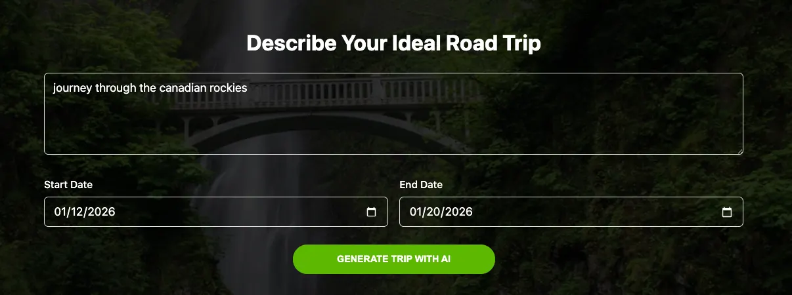
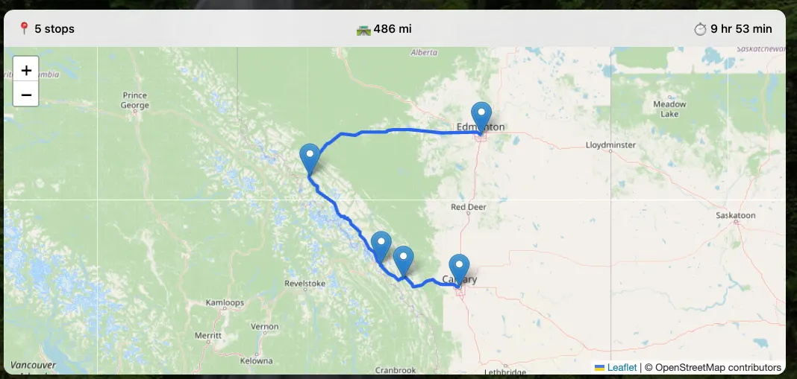
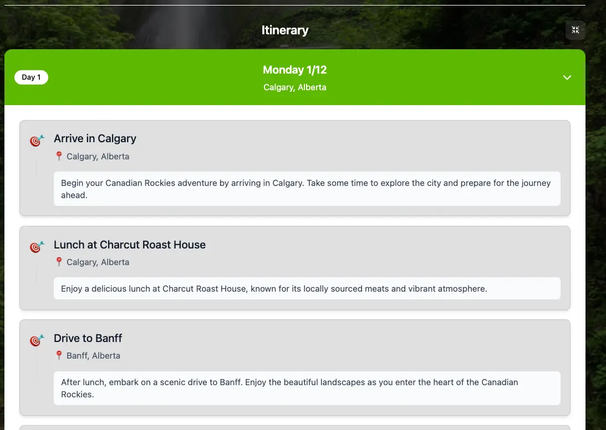
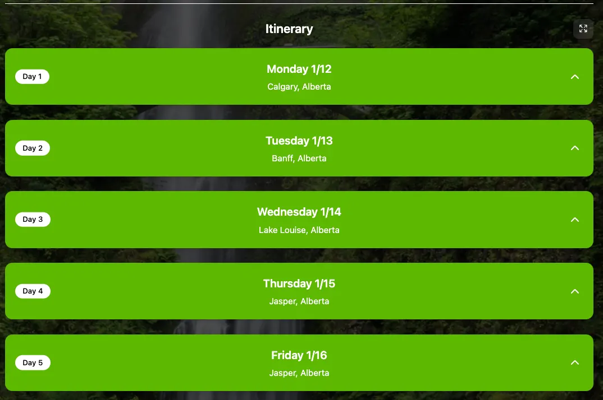

Building a road trip planning app powered by AI sounded simple, until users were staring at a blank screen for 30 seconds waiting for their trip to load.

I recently shipped a SaaS app called **Odyssey**, which lets users plan the details of a road trip — including activities, restaurants, hotels, and day by day navigation — by relying on an AI model to generate and iteratively refine the trip based on their preferences.

Along the way, I learned a lot about what it actually takes to integrate AI into a production app. With developers likely to be embedding AI into their products at an exponentially increasing rate in 2026, I think some of these lessons may be useful, and I wanted to share them here.

**Odyssey**

[Odyssey](https://findmyodyssey.com)

The idea behind Odyssey is straightforward. A user types in a prompt such as “journey through the Canadian Rockies” and can optionally provide a date range for the trip. After clicking “Submit”, the AI generated trip begins to fill the page, with a map showing driving directions and a day by day itinerary appearing as it is generated.


_User enters prompt, with optional date range._


_AI-generated trip metadata loads within 1–2 seconds._


_Route map loads concurrently with metadata._


_First day loads shortly after metadata + map._


_Remainder of trip streams in day-by-day (collapsed view)._

From there, the user can refine the trip by sending additional prompts to the AI. Each update builds on the existing plan, and the trip is persisted in the user’s account for future viewing and editing.

Under the hood, the app is powered by a React front end that communicates with an AWS Lambda function. That Lambda makes requests to the OpenAI API and streams responses back to the UI (covered in more detail below). Once trip creation is complete, the Lambda saves the full trip JSON to S3 and stores the associated trip metadata in DynamoDB. The app uses Cognito for authentication and sits behind a Cloudfront CDN.

**Lesson 1 — Streaming with NDJSON and Structured Tool Calls**

**The Problem**

My first version of Odyssey took a naive approach. It made a single request to the model, waited for the full response, and only then rendered the trip.

That worked fine in development when I was testing small prompts. But in production, real users asked for real trips. A 7 to 14 day itinerary can be a lot of data, and the model can take 20 to 30+ seconds to finish.

From a user’s perspective, that experience is brutal. You hit Submit and then nothing happens. Even if you show a spinner, it still feels like the app is stuck.

The bigger issue is that the AI response is naturally incremental. The model knows the title, then the high level plan, then the day by day details. If the UI could show those pieces as soon as they exist, the app would feel fast even when the full generation takes time.

**The Solution**

I switched to a streaming architecture built around three ideas:

1.  **Use the model’s streaming output**
2.  **Force structured data using tool calls**
3.  **Send each structured event to the client as NDJSON**

NDJSON is “newline delimited JSON”. Instead of returning one big JSON object, the server returns a stream where each line is a complete JSON message. That makes it easy to parse on the frontend because you can process the response line by line as it arrives.

The other key decision was using tool calls (function calling). Rather than letting the model free-form a giant response, I made it emit specific events in a specific order, with a specific structure. For example:

-   emit\_trip\_metadata once at the start
-   emit\_places for the list of places with coordinates
-   emit\_legs for travel legs between places
-   emit\_day once per day

The backend then converts each tool call into an NDJSON event and immediately flushes it to the client.

Now, the trip metadata appears in the UI within one to two seconds of the user submitting the request, as soon as that metadata is generated. A second or two later, the map begins to populate with driving directions as the places data arrives, complete with coordinates for each destination.

Immediately after that, the frontend receives enough NDJSON events to render the first day of the trip. Each subsequent day is then streamed in as it is generated, allowing the itinerary to progressively fill in as data becomes available.

**Lesson 2: Iterate Relentlessly on Your AI Instructions**

**The Problem**

My first prompt was vague:

> _“Plan a road trip based on user input.”_

Sometimes it worked. Other times the AI would cram twelve activities into a single morning, suggest driving 2,800 miles in one day, or return coordinates in the middle of a lake.

The fix was not one big rewrite. It was dozens of small iterations, each addressing a specific failure I discovered by actually using the app.

**The Solution**

After a few days of tweaking, my system prompt evolved into a dense and highly explicit set of rules. At first glance, it looks excessive. In practice, every line exists for a reason.

```javascript
const systemPrompt = [
  "You are a trip-planning engine. You MUST create a complete trip plan using the provided tools.",

  // Force structured output
  "IMPORTANT: You must call the requested tool when called: emit_trip_metadata, emit_places, emit_legs (optional), emit_day.",

  // Driving constraints
  "DRIVING LIMITS: NEVER exceed 10 hours or 1500 miles of driving in a single day. For longer routes, add intermediate stops or split the journey across multiple days.",

  // Coordinate accuracy
  "ROUTABLE COORDINATES CRITICAL: Every place coordinate MUST be within 350 meters of a driveable road. Use parking lots, street addresses, or visitor center entrances. NEVER use coordinates deep inside parks, forests, lakes, or wilderness.",

  // Routing logic
  "ROUTING EFFICIENCY: Create a logical geographic flow between destinations. Each location must be visited exactly once.",

  // Activity density
  `CONSTRAINTS: Maximum ${maxActivitiesPerDay} activities per day. Include exactly ${tripDays} days.`,

  toolRules,
].join(" ");
```

**Lesson 3: Protect Your Budget with Usage Tiers**

**The Problem**

Every API call to OpenAI costs money. A single trip generation might only cost a few cents, but those costs add up quickly. Without guardrails, one enthusiastic user could generate hundreds of trips and burn through your monthly budget in a single day.

More importantly, AI powered features have a fundamentally different cost structure than traditional SaaS. Most product interactions are effectively free. A user clicking around your UI does not meaningfully increase your AWS bill. AI requests are different. Each request has a direct, measurable cost that scales linearly with usage.

If you do not design for that reality from the beginning, success can become expensive very fast.

**The Solution**

I implemented a simple tiered usage system. Free users get 10 AI requests per week, and each trip can be a maximum of two weeks. Pro users get 100 requests per week and can generate trips up to 30 days in length.

I added a DynamoDB table to track user status and usage rates, and set up a Stripe integration to handle the Pro subscription upgrade. Now, casual users can enjoy the product for free, while power users pay a small fee.

**Conclusion**

Getting up and running with an AI-powered up is relatively straightforward. Calling a model and getting a response working can happen in a single afternoon. Shipping something reliable, fast, and financially sustainable is a very different problem.

For Odyssey, three lessons made the difference. Streaming with NDJSON and structured tool calls transformed long waits into an experience that felt alive. Iterating relentlessly on instructions turned unpredictable output into something the rest of the system could depend on. And usage tiers made the entire product viable by aligning user behavior with real world costs.
