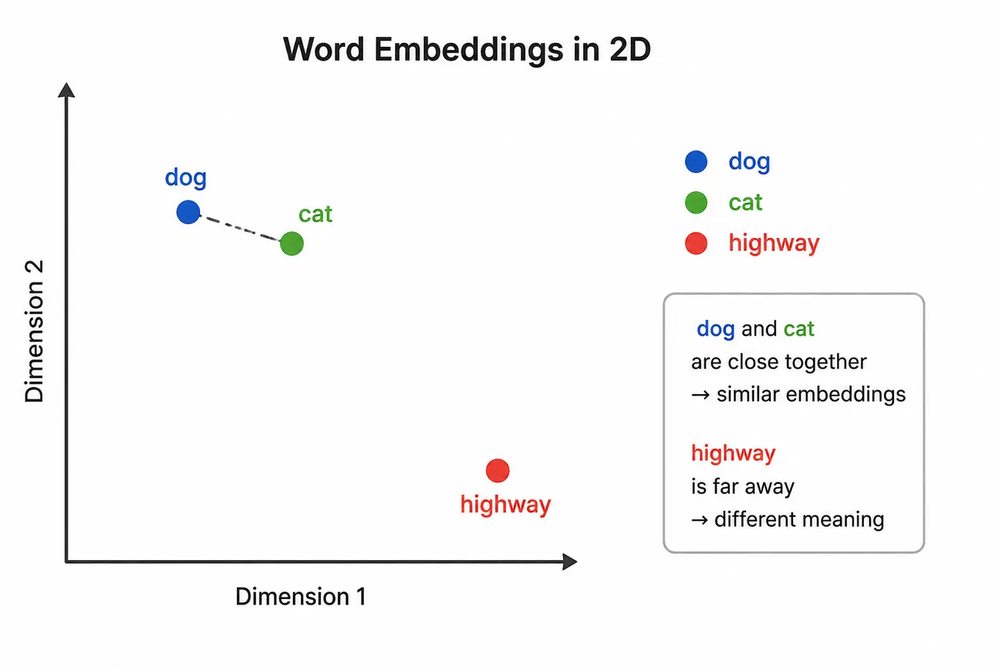

The introduction of large language models (LLMs) has caused a tectonic shift in how software is built. When combined with agentic coding harnesses, LLMs can now perform many of the tasks once thought to be the exclusive domain of human software engineers. These tools can write, analyze, and debug code with a level of competency that would shock a time traveler arriving from earlier in this decade.

LLMs empower us to be more productive, remove drudgery, and have greater impact in our work, but they also threaten us — will they eventually replace us entirely?

These days, software engineers spend a lot of time thinking about, and using, LLMs. But by and large, most software engineers treat them as a black box — prompt goes in, code comes out. Not many people outside of the machine learning community have taken the time to understand exactly how this technology works. Since LLMs have such a big impact on our work and our lives, I think it is important to try to understand them.

This summer I decided to learn about how LLMs work under the hood. In addition to consuming many YouTube tutorials and blog posts from experts in the field, I read the following books:

-   _Hands-On Large Language Models_ by Jay Alammar and Maarten Grootendorst
-   _AI Engineering_ by Chip Huyen
-   _What is ChatGPT Doing and Why Does It Work?_ by Stephen Wolfram
-   _Build a Large Language Model From Scratch_ by Sebastian Raschka

At the end of the day, an LLM is just another piece of software, albeit a quite sophisticated one. I believe that any software engineer who has spent years reading and analyzing code can leverage this experience to learn how LLMs work as well.

In this article, I want to provide a starting point: a software engineer’s guide to LLMs. We’re going to walk through each piece of the LLM architecture step by step, starting with the initial prompt and going all the way through to the final text output. By the end, you should have a strong mental model for how these things work.

But first, let’s start with an overview of machine learning, the technology that LLMs are built on top of.

### A 10,000 Foot View of Machine Learning

Machine learning is about creating software that can learn from patterns in data. This is in contrast to traditional software systems, where programs are told how to behave explicitly in code. Machine learning models are able to make predictions about data they haven’t seen before, based on what they learn from data they have been “trained” on.

During the training phase, these models are fed data, and they make predictions based on this data. This is the “forward pass” through the system.

After the predictions are emitted, they are compared to the actual correct outcome, and a calculation is made to determine how close the prediction is to the actual correct/desired result. This is called the “loss function.”

What counts as the “correct” outcome varies depending on the goal of the system. An example of a simpler machine learning system model would be one that accepts a piece of text and determines whether it demonstrates positive or negative sentiment. Here, the “correct” outcome is a binary value: “positive” or “negative.” This is known as a “classification” model. (As we’ll see later in this article, the “correct” outcome for an LLM is far more complex: it can be any one value out of the model’s total “vocabulary,” which typically encompasses tens of thousands of values.)

Next, information about the degree of “loss” is passed back through the model. The model uses this information to make adjustments so that it can make a better prediction the next time it encounters that input, or something similar to it. This is the “backward pass” through the model, also known as **backpropagation**.

How exactly does the model make these adjustments? A machine learning model is made up of “weights,” which you can think of as connections between nodes. If you are familiar with graph theory in computer science, a machine learning model can be visualized as a graph with weighted edges and nodes. These systems are modeled after the human brain, which contains billions of neurons (nodes) that have weighted connections between each other (edges).

Sophisticated machine learning models have billions of these connections, and they each have a weight. When a model is first built, each weight is seeded with a random value. As the model undergoes the training process described above, the weights are adjusted, allowing the model to “learn” from the data it has processed and applying that learning when it processes future data.

![The training loop drawn as a cycle of five steps: training data of examples with correct outcomes, such as "I love this!" labelled positive; a forward pass in which the model makes a prediction; a loss step comparing that prediction to the correct outcome and calculating how far off it is; backpropagation, passing the loss information back through the model to determine how each weight contributed to the error; and a weight update that adjusts the connections to reduce the loss, after which the loop repeats with more data.](../images/a-software-engineers-guide-to-large-language-models/1.webp)
_A simplified diagram of the machine learning training loop for a binary classification system._

After a machine learning model is trained, it is ready to be used in the real world. A fully trained machine learning model can accept new inputs it has never seen before, and use the information it gained from its training data and recorded in its weights to provide accurate responses to those novel inputs. This final stage of actually using a machine learning model to generate responses to real-world inputs is called “inference.”

### What Makes LLMs Different

LLMs are an extension of the machine learning paradigm outlined above. Rather than simply classifying inputs into categories, like our positive-versus-negative sentiment classifier, LLMs can generate entirely new outputs. This is why they fall under the umbrella of “generative AI”: instead of simply placing inputs into predefined categories, they generate new content.

A standard classification machine learning model has a predefined set of possible outputs. Our positive-versus-negative sentiment classifier has two: positive and negative. You could imagine another classifier for grouping emails into personal, work, spam, social, etc. This one could have potentially 5–6 possible outputs. In either case, the number of possible outputs is static and predefined, and the machine learning model chooses one of them when it processes a specific input.

In LLMs, the set of possible outputs can be thought of as all possible **tokens** in the model’s vocabulary. I’ll explain exactly what a token is shortly, but for now you can loosely think of tokens as words, parts of words, and symbols. If we forget code for the moment, we could imagine an LLM that only produces English text. This model’s vocabulary would consist of all words in the English language, along with punctuation characters. This amounts to tens of thousands of tokens.

Conceptually, you can think of an LLM’s process in the following way: it iterates through the provided input text, and on each iteration, it predicts the next token, appends that token to the input, and then processes the new text with the token appended. It does this repeatedly until the full response is generated.

The training for an LLM is quite similar to the training for traditional machine learning models discussed above. In our simple sentiment classifier, the model predicted one of two values, and then used the provided “correct” data to determine if it was correct. There, the “correct” data was a **label** provided to the model (usually by a human) of “positive” or “negative.”

In LLMs, the “correct” next token is simply _the next token in the training data_. When training an LLM we start with a full piece of text. Initially, the LLM consumes the first token, and it outputs its prediction of what the next one will be. This prediction is compared with the _actual_ next token in the input text, and then the loss function is run and backpropagation occurs based on that. This continues iteratively for every token in the input. Because the text itself is used as the source of truth, we don’t require human-labelled data to train LLMs. (Human feedback is generally required at a later stage of LLM development, but not for initial training.) Because of this, the initial training of LLMs is referred to as **self-supervised training**.

By repeatedly learning to predict the _next_ token in a sequence, LLMs learn complex patterns and relationships between tokens, including how their meanings depend on the context in which they appear. This is the key insight that explains how they are so effective at generating text, simply by predicting one token at a time. When training is over and it’s time for inference (i.e., real-world use), the model’s weights encode an enormous amount of information about the patterns and relationships it encountered during training, allowing it to apply what it learned to new sequences of tokens.

### The Architecture of a Large Language Model

Next, we are going to follow a single input’s path through the full LLM architecture.

Here is a high-level roadmap of what we will explore:

We will see how the input text is turned into **tokens**, which are then converted into **embeddings**. These embeddings are passed through a number of **transformer blocks**, which contain (1) an **attention mechanism** and (2) a **feed-forward network**. Finally, the **language model head** produces a **vector** containing a raw score for each token in the model’s vocabulary, and the **sampling** step uses those scores to select the next token. This process repeats until an **end of sequence** condition is reached.

![The seven stages of the architecture. Input text from the user goes to a tokenizer, which breaks it into token IDs; embeddings convert each ID into a vector; the vectors pass through N transformer blocks, each applying self-attention and then a feed-forward network; the LM head maps the final hidden state to one logit per token in the vocabulary; sampling converts those logits to probabilities and selects the next token; and the process repeats with the selected token appended, until a stop token is generated or a maximum length is reached.](../images/a-software-engineers-guide-to-large-language-models/3.webp)

#### First, A Small Amount of Linear Algebra

LLMs rely heavily on linear algebra, which is a branch of mathematics that deals with vectors, matrices, and operations on them. Don’t be scared by the term “linear algebra”; we’re not going to get very math-heavy in this article. But, we do need a high-level understanding of the operations the LLM is performing and the terms used to describe these operations before we proceed.

The two important terms we need to understand are **vector** and **matrix**. A **vector** is just an ordered list of numbers, e.g., \[2, 5, 1\]. It is represented as an array in machine learning code. A **matrix** is a rectangular grid of numbers, e.g. \[\[1, 2, 3\], \[4, 5, 6\]\]. Matrices are represented as multi-dimensional arrays in code. If you’re a software engineer, these will be familiar data structures.

A matrix can be thought of as a **transformation;** it turns one vector into another. The core mathematical operation in an LLM is **matrix multiplication**, where a vector is multiplied by a matrix _to produce a new vector_. You can think of this as taking the information represented by the original vector and _transforming_ it into a new representation. LLMs perform these transformations over and over as information moves through the model.

These transformations are how LLMs represent the weighted edges of the neural network that we discussed in the machine learning section above. **Each** **value in a weight matrix represents a learned weight in the neural network**, determining how strongly one input value contributes to an output value.

To multiply two matrices, you multiply every row of the first matrix by every column of the second matrix:

There are two more concepts that we will reference below that you need to know:

First, **dot product**. Dot product takes two vectors of the same length and produces a single number by multiplying the corresponding numbers in each vector and then adding those values together. For example: If A = \[2, 3, 4\] and B = \[5, 1, 2\], then the dot product is: (2 x 5) + (3 x 1) + (4 x 2) = 21. Below we will use dot product to create a single number from two vectors.

Second is **softmax,** which is a function that takes a list of numbers of arbitrary value and turns them into values between 0 and 1 that sum to 1. This is useful because it takes different lists of values and normalizes them so they can be compared. For example, softmax would turn the vector \[1.2, 1.5, 1.0\] into \[0.32, 0.43, 0.26\]. Below, we will use softmax to normalize the raw output of some operations into values that can be passed into other parts of the system.

#### 1\. The Input

Everything starts with the input. When you submit a prompt, the agentic harness passes the prompt along, together with the **context** and a **system prompt**. The context is all of the previous prompts and responses in the session, along with any data retrieved by the agentic loop. The system prompt gives the LLM meta-instructions such as “You are an expert software engineer. Write clean, maintainable code and explain your solutions concisely.”

As responses are generated, new prompts are submitted, and data is retrieved from other sources, all of this information is appended to the context and passed back into the LLM as input.

#### 2\. The Tokenizer

Next, a **tokenizer** takes the input text and breaks it down into **tokens**. Tokens are IDs that represent words, parts of words, or symbols. For example, the sentence “Write a function that sorts an array” might be transformed into a token array such as \[8144, 264, 734, 430, 29371, 459, 1358, 13\], with the tokens representing the following English language words and punctuation: \["Write", "a", "function", "that", "sorts", "an", "array", "."\]. The model maintains a map of token ID -> token and an inverted map of token -> token ID for easy transformation.

I mentioned above that a token may be a “part” of a word. Tokenizers don’t perform a 1:1 mapping from word -> token. Instead, many subparts of words are stored as unique tokens. For example, common word subparts like ing, ed, un, and parts of contractions like 'nt and 's are their own tokens in many tokenizers. This is an optimization that allows the model to work with a smaller vocabulary, which improves efficiency and reduces memory footprint. (We’ll see below that models work with vectors that are the length of the total number of tokens in the vocabulary, which is why this optimization is important.)

There are also special tokens that models may use internally. For example, the <EOS> “end of sequence” token represents the end of the model’s generated response. When a harness sees the <EOS> token in the response, it knows to stop asking for more response tokens. Another example is the <PAD> token, which some models use when processing multiple sequences together in a batch. Because the sequences in a batch may contain different numbers of tokens, shorter sequences can be padded with extra positions so that every sequence has the same length.

#### 3\. Embeddings

After we have our list of tokens, the model generates **embeddings** for each token. An embedding is a learned vector representation of a token. The values in this vector capture information the model has learned about how that token tends to be used.

You can think of these embeddings as representing a point in an n-dimensional space, with n being the length, or **dimension** of the embedding. (Embeddings in today’s largest models can have dimensions of over 10,000.) Tokens that are similar to each other, such as tokens representing “dog” and “cat”, will often have similar embeddings. Since it’s impossible for humans to visualize a 10,000-dimensional space, this concept is usually represented using a simple 2D graph:

The numbers in the embedding vectors are **trainable parameters**, which means they are learned by the model during training. As the model processes more and more tokens during training, it learns how tokens tend to be used and related to one another, and updates the embeddings accordingly.

The rest of the processes we discuss below involve the model performing transformations on these initial embeddings to eventually produce the desired output.

#### 4\. Transformer Blocks

Now that we have converted each input token into an embedding, we can get on to the core of the LLM: the **transformer blocks**.

From this point forward, it is more accurate to think of each token as having a **vector representation** that changes as it moves through the model. The simplest way to think about a transformer block is that it accepts a token’s current vector representation, _transforms_ it, and returns a new vector representation. LLMs contain many transformer blocks, each with different internal weights. Each transformer block applies its transformation to the representation and passes the result to the next transformer block.

With each transformation, that representation incorporates more information about the token’s relationship to the other tokens in the input. In this way, the token’s initial, context-independent embedding is gradually transformed into a **contextualized representation** whose values reflect how that token is being used in the particular sequence.

LLMs typically have several transformer blocks, which process the input one after the other; the output of one transformer block is the input to the next.

A transformer block consists of two main components: the **attention mechanism** and the **feed-forward network**.

#### The Attention Mechanism

The purpose of the attention mechanism is to allow a token to look at all the tokens that came before it in the sequence and decide how relevant each previous token is to it. For example, when processing the token “it” in the sentence “The dog chased the ball because it was excited,” the attention mechanism may identify a strong relationship between “it” and “dog,” and a weaker relationship between “it” and “ball.”

Note that the token only looks at the tokens that came before it, not those that come after it. This restriction — allowing each token to “attend” only to itself and the tokens that came before it — is known as **causal attention**. It is what allows the model to operate **autoregressively**: predicting the next token based on the tokens that precede it.

This process is computationally expensive. Each token’s query is compared against the keys of every token it is allowed to attend to. As the sequence gets longer, the total number of these attention relationships grows roughly with the square of the sequence length, giving standard self-attention **O(n²) complexity**.

This computational cost is one reason the number of tokens a model can consider is bounded by its **context window**, which is the maximum number of tokens a model can process in one pass. Longer context windows require the model to compute and manage many more attention relationships, making them increasingly expensive. So, every model has a limit on how much context it can consider when generating its next token.

The attention mechanism is supported by three trainable weight matrices: the **key**, **query**, and **value matrices**. These matrices transform each token’s representation into three different vectors. The **key vector** represents the token to other tokens; in other words, it _advertises_ what information the token contains. The **query vector** represents what the token is looking for when it looks at other tokens in the sequence. The **value vector** represents the information the token will contribute if another token pays attention to it. During training, the model learns the weights contained in these matrices.

When the attention mechanism receives a token’s vector, it multiplies it by each of the three matrices to produce a key, query, and value vector. The matrices are the same for every token’s vector; in other words, the same transformations are applied to each token.

Next, the token’s query vector is compared against each preceding token’s key vector. Specifically, the model computes the **dot product** of the query vector and the other token’s key vector, which, as we discussed earlier, returns a single number. This number is called the **attention score**, which indicates how relevant that preceding token is to the current token.

It does this for every preceding token, which results in a vector containing the attention score for each preceding token as it relates to the current token.

Next, the vector of attention scores is passed to the **softmax** function, which, as we also discussed earlier, normalizes the results so that the values in the vector are between 0 and 1, and all the values sum to 1.

These resulting weights tell the attention mechanism _how much information to take from each preceding token_. The attention mechanism then transforms each preceding token’s value vector by multiplying each item in that vector by the computed attention weight for the vector.

Finally, it adds all of the transformed value vectors together, element by element. The result is a new vector where each value contains a weighted combination of the corresponding values from the value vectors of the preceding tokens. This final vector is the **attention output** for the token.

![How attention is computed for the token "it" in the sentence "The dog chased the ball because it was excited". Three trainable matrices — query, key and value — each multiply the token's vector to produce its query, key and value vector. Then five steps: the query for "it" is compared by dot product with the keys of every preceding token to give attention scores; softmax normalizes those scores into weights between 0 and 1 that sum to 1, with "dog" taking the largest weight at 0.64; each preceding token's value vector is multiplied by its weight; the weighted value vectors are added together element by element; and the sum is the attention output for "it", a single vector summarizing information from all preceding tokens.](../images/a-software-engineers-guide-to-large-language-models/6.webp)

One final twist before we move on to the next step in the process: inside each transformer block, there are actually _multiple_ attention mechanisms. Each attention mechanism is called an **attention head**, and the concept of using multiple attention heads inside a single transformer block is referred to as **multi-head attention**.

Each attention head can learn to focus on different kinds of relationships between tokens. For example, one head might learn to focus on grammatical relationships, while another might focus on which words refer to the same entity. What an attention head learns is entirely organic — attention heads are not programmed to seek out specific information. They each start with a different set of random initial values, and adjust those values based on what they learn during the training process. In that sense, what they learn about the relationship between tokens is entirely opaque to humans; we don’t necessarily know what the weights inside an attention head represent semantically.

Because there are multiple transformer blocks in a typical LLM, and because each transformer block contains multiple attention heads, the total number of attention heads in a model is equal to the number of transformer blocks multiplied by the number of attention heads per block.

Each attention head emits its own output vector for the current token. The output vectors from all of the attention heads are then concatenated together.

The concatenated vector is then multiplied by another trainable weight matrix, called the **output projection matrix**, which mixes the information produced by the different attention heads and produces the final output of the multi-head attention mechanism. This output is typically the same dimension as the token representation that originally entered the attention mechanism.

> **_Note:_** _Matrix multiplication is frequently used to transform vectors of length_ _x into vectors of length_ _y, as we just did above. In other words, to take a long vector and turn it into a shorter one, or vice versa. Since matrix multiplication involves multiplying each row of the first matrix by each column of the second matrix, we can multiply a single vector of length_ _x (which can be thought of as a_ _1 \* x matrix) by a matrix of dimensions_ _x \* y, and the resulting vector will be length_ _y._

#### The Feed-Forward Network

The other primary component of a transformer block is the **feed-forward network (FFN).** While the attention mechanism mixes information between tokens, the feed-forward network processes a single token individually.

The feed-forward network receives a vector representing the learned values for a token from the attention mechanism, and immediately expands that vector into a higher dimension (i.e., longer) vector. For example, if the input vector has 4,096 values, the feed-forward network will expand it to something like 16,384 values. (It does this by using matrix multiplication in the way described in the Note above.)

Next, it applies what is called a **nonlinear activation function** to the expanded vector. This is necessary due to the fact that several transformer blocks are stacked on top of each other in the LLM architecture. Since each transformer block is, at its core, performing a series of matrix multiplications, without introducing nonlinearity somewhere in the process, stacking multiple blocks would be mathematically equivalent to performing a single, more complex linear transformation. The nonlinear activation function breaks this linearity, which allows the network to learn more complex patterns and relationships in the data.

There are different activation functions used in practice. The simplest one is probably ReLU (Rectified Linear Unit), which just turns any negative number into 0. So, \[-2, 0.5, 3, -1\] becomes \[0, 0.5, 3, 0\]. Another popular activation function is GeLU (Gaussian Error Linear Unit). GeLU is more advanced and creates a more gradual activation. (The details of these activation functions are too dense to include here and are not necessary to understand the core concepts we’re discussing.)

After applying the activation function, the feed-forward network contracts the expanded and activated vector back to its original dimension, using the same matrix multiplication process we discussed above.

So, at a high level, the feed-forward network (1) expands the initial vector, (2) applies an activation function, and then (3) contracts the vector back to its original size. The two matrices used to expand and then contract the vector contain learned weights, which allow the model to apply transformations it learned during training to each token’s vector. The activation function introduces nonlinearity between these transformations, allowing the network to learn complex patterns that could not be represented by a linear sequence of matrix multiplications alone.

#### Layer Normalization

There is one final wrinkle we need to touch on before we end our discussion of the architecture of the transformer blocks: **layer normalization**.

The point of layer normalization is to keep the numerical scale of the vectors stable as they repeatedly pass through transformations. If the values become extremely large or small, the behavior of attention and the FFN can become unstable and, especially during training, gradients can become difficult to manage.

The layer normalization function **rescales** and **re-centers** the vector’s values, so that they have a **mean** of 0 and a **variance** of 1. For example, the vector \[2, 4, 6\] has a mean of 4 and a variance of 2.67. After applying the normalization function, the vector would become \[-1.225, 0, 1.225\]. Now, the mean is 0, and the variance is 1.

> **_Note:_** _If you are not familiar with the concept of variance, it involves measuring how “spread out” a set of numbers is. To calculate it, you find the average of the numbers, determine how far each number is from that average, square those differences, and then take their average._

In many modern transformer architectures, a normalization operation is applied before the attention mechanism and again before the feed-forward network, although architectures vary.

#### 5\. The Language Model Head, Temperature, and Sampling

After our token has finally exited the last transformer block, it runs through the **Language Model Head**, or **LM Head**. The purpose of the LM Head is to generate a vector that is the length of the model’s vocabulary, where each item represents a **raw score** for the corresponding token in the vocabulary.

The LM Head accomplishes this by doing yet another matrix multiplication. This time, it multiplies the final vector outputted from the last transformer block by another learned weight matrix, to create a vector that is the length of the model’s vocabulary.

The values in this resulting vector are called **logits**. Each logit is a raw score for one token in the model’s vocabulary: the higher the score, the more strongly the model believes that token should come next.

We now have a vector that is the same length as the model’s vocabulary, where each item is a raw score representing how strongly the model believes that the corresponding token should come next. So, we should be able to simply find the maximum value in the vector and return that token, right?

Researchers discovered early on that this approach tends to produce repetitive and overly predictable text. It became obvious that introducing some amount of nondeterminism into an LLM created much more natural and useful responses.

This is where **temperature** and **sampling** come in. Temperature is a configurable setting that controls how much randomness is introduced when selecting the next token. Before converting the logits into probabilities, the model divides each logit by the temperature.

For example, suppose the LM Head produces the following three logits:

\[3, 2, 1\]

With a temperature of 1, dividing the logits by the temperature does nothing:

\[3, 2, 1\]

But with a lower temperature of 0.5, the logits become:

\[6, 4, 2\]

This increases the differences between the logits. With a higher temperature of 2, they instead become:

\[1.5, 1, 0.5\]

This decreases the differences between them.

After the temperature has been applied to the logits, they are run through the softmax function. As we discussed above, the softmax function converts every value in the vector into a value between 0 and 1. Because softmax emphasizes differences between its inputs, a lower temperature produces an output that is more heavily concentrated around the tokens with the highest probabilities, while a higher temperature produces an output that is more evenly distributed.

Finally, the model **samples** from this probability distribution, by randomly selecting a token according to the probabilities that emerged from the above logits -> temperature -> softmax process. Here, a token with a 70% probability has a 70% chance of being selected, while a token with a 10% probability has a 10% chance.

#### 6\. End of Sequence, or Continue?

Finally, the selected token is then appended to the sequence. If the selected token is the <EOS> “end of sequence” token, or if another end of sequence condition is reached (such as a maximum token limit), generation stops. Otherwise, the sequence, with the newly generated token appended, is processed again to predict the next token. This process repeats, one token at a time, until a stopping condition is reached.

### Conclusion

And that’s it. We’ve followed an input all the way through a large language model: from raw text, to tokens, to embeddings, through the transformer blocks, and finally through the LM Head and sampling process to produce the next token. That token is appended to the input, and the process starts all over again.

Of course, we’ve glossed over a lot of details in our attempt to describe the LLM architecture at a somewhat high level. For example, we discussed training vs. inference, but there is actually an intermediate stage between the two called **fine-tuning**, which helps LLMs generate responses that are more amenable to human sensibilities. We also did not explore the backpropagation process, where information is sent back through the model in reverse and the model’s weights are adjusted based on the errors it made during training. Nor did we discuss techniques like reinforcement learning from human feedback, quantization, mixture-of-experts architectures, or the many optimizations that make training and running modern LLMs practical at enormous scale.

Each of these topics could warrant an entire article of its own, and I hope to cover some of them in the future. But for now, thank you for making it all the way to the end. I hope this article has helped demystify LLMs and shown that, despite their remarkable capabilities, they are not magic black boxes. They are software systems built from understandable pieces, working together in surprisingly powerful ways.
